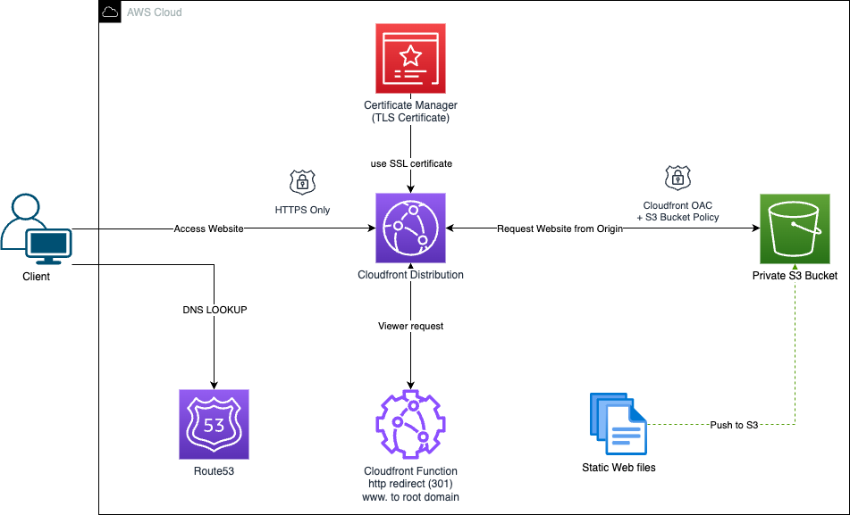

# Project Steps: Static Website Hosting on S3

## 🌟 Key Features of the Project
- **Custom Domain Integration**: Hosted the website on a custom domain name with DNS routing via Route 53.
- **Secure Hosting**: Implemented HTTPS using AWS Certificate Manager (ACM) and CloudFront.
- **Error Pages & Redirects**: Configured custom error pages and URL redirects within S3.
- **Completely Serverless**: The project demonstrates the power of serverless hosting for static websites.

## 🛠 Tech Stack
- **AWS Services**: S3, Route 53, CloudFront, AWS Certificate Manager.
- **Frontend**: HTML5, CSS3, JavaScript

## 📜 Project Workflow

### **1️⃣ Setup and Configuration**
- Created and configured an **S3 bucket** to host the static files.
- Enabled **public access** and **static website hosting settings**.

### **2️⃣ Content Upload**
- Designed and uploaded the **frontend files (HTML, CSS, JavaScript)**.
- Ensured all assets were **optimized for fast delivery**.

### **3️⃣ Domain Name Integration**
- Registered a **custom domain** and linked it via **Route 53**.
- Configured **DNS records (A and CNAME)** to point to **S3**.

### **4️⃣ Enhanced Security and Performance**
- Integrated **CloudFront** as a **content delivery network (CDN)** to improve speed and global reach.
- Secured the website with an **HTTPS certificate** from **AWS ACM**.

### **5️⃣ Custom Error Pages and Routing**
- Added a **404.html** file for handling missing pages.
- Configured **redirects** for better user experience.

### **6️⃣ Testing and Deployment**
- Performed thorough **testing** for responsiveness, speed, and accessibility.
- Successfully **deployed** the project and monitored usage via AWS tools.

## 🚧 Challenges and Solutions

| Challenge | Solution |
|-----------|----------|
| Setting up HTTPS and CloudFront distribution | Followed AWS best practices to automate ACM certificate creation and CloudFront integration. |
| Managing cross-region latency for faster access | Leveraged **CloudFront edge locations** for content delivery. |

## 🎯 Learnings and Impact
- Gained **hands-on experience** in serverless architecture and cloud hosting.
- Enhanced my understanding of **DNS, CDN, and HTTPS implementation**.
- Delivered a **cost-effective hosting solution** suitable for personal projects or businesses.

---
## 📸 Architecture Diagram

